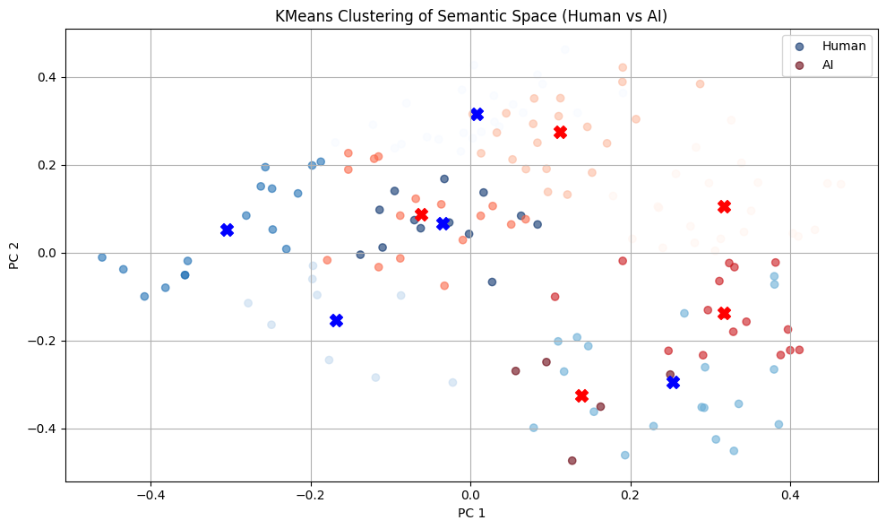

# Semantic Drift

Modern AI detectors rely heavily on signals like **perplexity** and **burstiness** to distinguish human and AI generated text. But these often ignore how meaning evolves through a piece

This project explores whether **semantic drift** can serve as a complementary signal for detection. In 2024, Meta published a paper called [A Study of Semantic Drift in Text Generation](https://ai.meta.com/research/publications/know-when-to-stop-a-study-of-semantic-drift-in-text-generation/). This paper covers factual drift, which checks for eventual logic decay. Accroding to Meta, AI generated text tends to experience factual drift after ~50 atomic facts.

## Data
Two matched samples (AI vs human) writing about the same topic: [“Why can’t we read anymore?”](https://hughmcguire.medium.com/why-can-t-we-read-anymore-503c38c131fe) from Medium.

To create something similar, I prompted Gemini:
> "Write a ~2200 word personal essay reflecting on why it’s become harder for people to engage deeply with books and long-form reading. Don’t reference specific articles. Instead, explore the psychological and cultural effects of digital tech, using original examples and a reflective tone like a thoughtful blog post was prompted to Gemini."

## Visuals
I only have one data point so far, so take everything with a grain of salt. 

### Sentence-to-Sentence Cosine Drift
Measures how much the meaning shifts between adjacent sentences.

AI shows **tight semantic rhythm**, while humans drift more variably.

---

### Drift Delta (Volatility of Meaning Change)
Second-order differences between adjacent sentence pairs.

Human writing exhibits more **semantic volatility**, reflecting spontaneity in flow.

---

### Semantic Path through Embedding Space
Visualizes sentence-level semantic trajectory (PCA-reduced 2D path).

AI moves more **linearly**, while human writing veers off in distinct directions.

### KMeans Clustering of Sentence Embeddings
Each point = one sentence embedding, clustered into 5 topics.

AI sentence cluster **tightly** and repetitively. Human clusters are more **spread**, suggesting wider topical coverage and idea development.

---

### KMeans Clustering of Paragraph Embeddings
Each point = one paragraph embedding, clustered into 5 topics.

AI paragraphs cluster **tightly** and repetitively. Human clusters are more **spread**, suggesting wider topical coverage and idea development.

## Limitations & Next Steps
- only one pair of samples :( (more data needed)
- sentence boundaries may not align perfectly
- need more writing samples from diverse domains (ie. science, culture, etc)
- add a metric for referential drift: named entity core ref tracking

### Set Up
To set up the virtual env:
`python -m venv drift-env`
`.\drift-env\Scripts\Activate.ps1`
`pip install -r requirements.txt`
